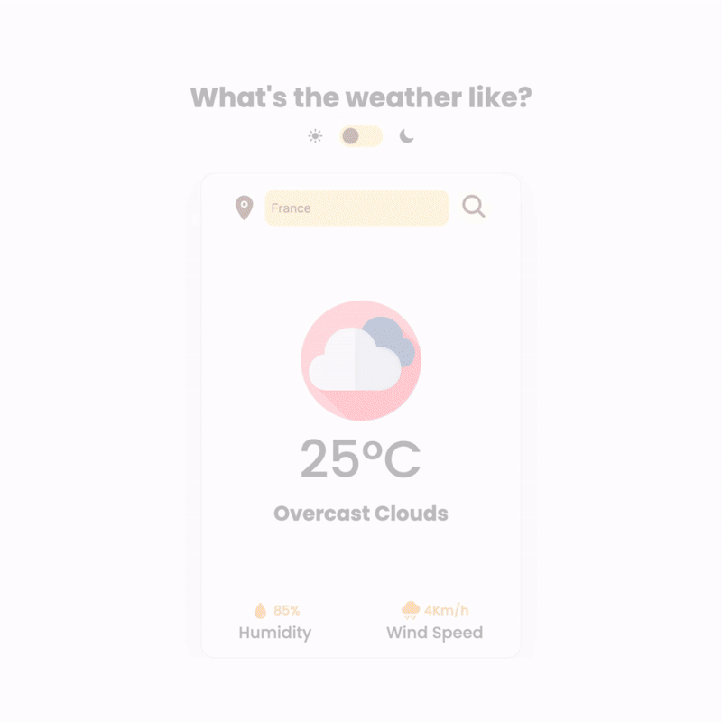

# Weather app with JavaScript

## What's the weather like?
This is a simple weather app built with JavaScript that shows the forecast for almost any city or country. The app gets the forecast data using the [OpenWeatherMap](https://home.openweathermap.org/) API.

A few highlights about this project are: 1.) it can handle most edge cases with no delay, and 2.) it is intuitive enough for users to use.

## API usage
OpenWeatherMap API is super easy to integrate, and all data loads quickly. However, its usage requires a **key** that is provided to you when you sign in. That means it must be "exposed" to the script functionality to run on the client side. This should not be an issue since these APIs are meant to be used publicly. But I guess it doesn't hurt to have that clear.

## To inprove
The app works; it doesn't do what was intended initially. Nonetheless, here are a few keys I want to improve on this project:

- [ ] Responsiveness
- [ ] Color palette
- [ ] Renaming variables
- [ ] Different approach?
- [ ] ...

I hope to have those (and any others I might've missed) in a few weeks. :)